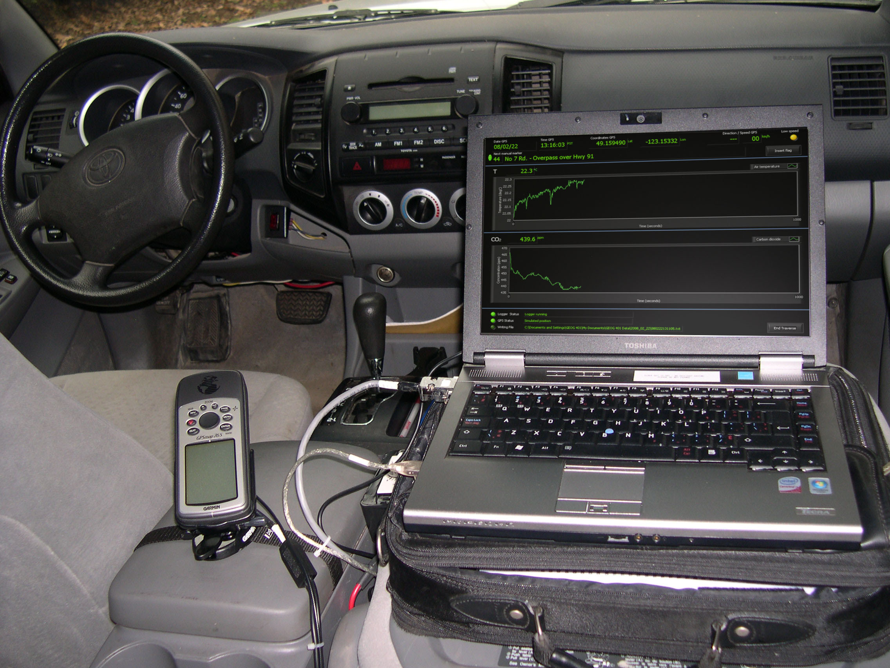
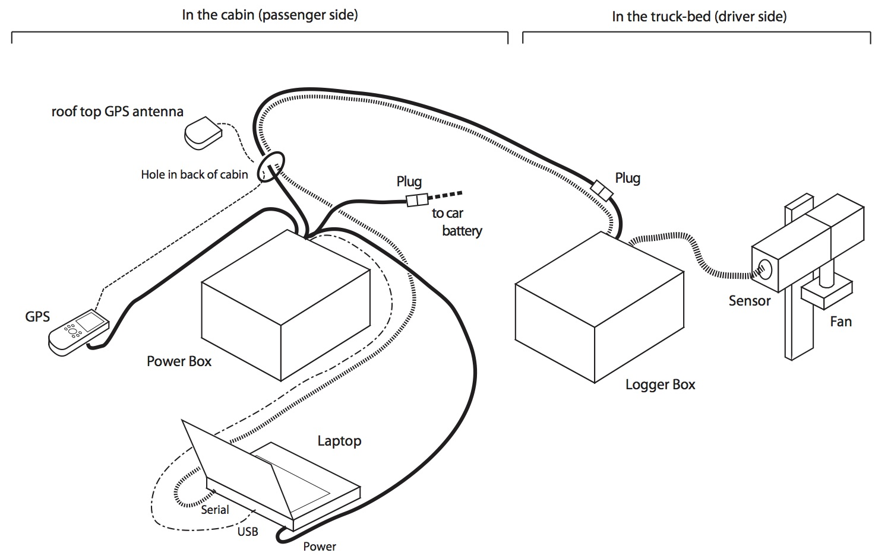
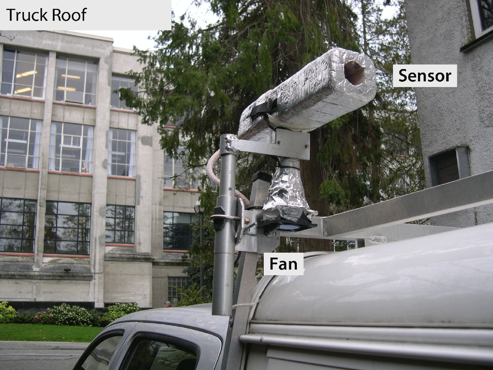
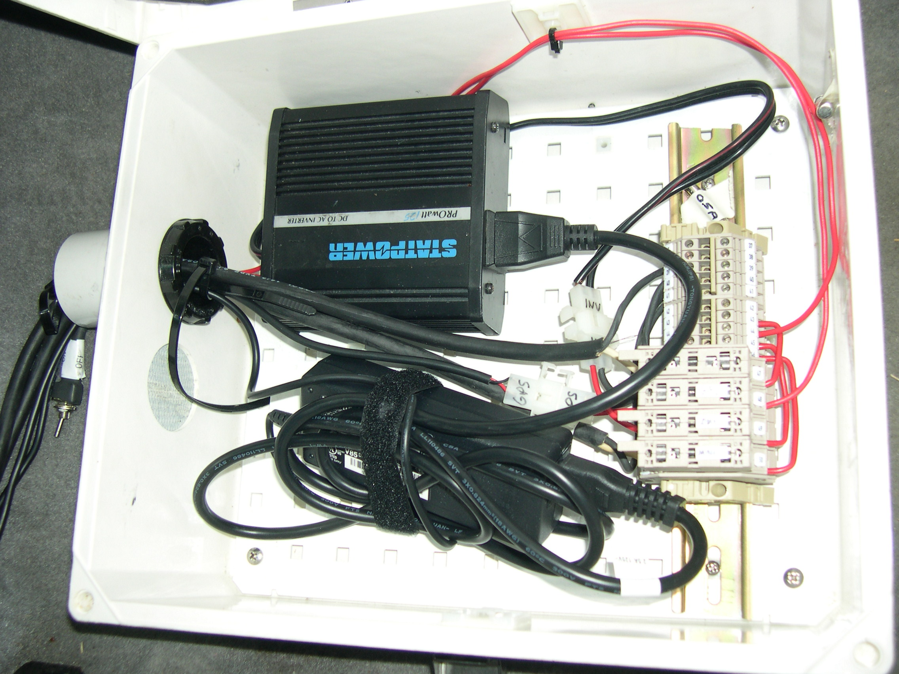
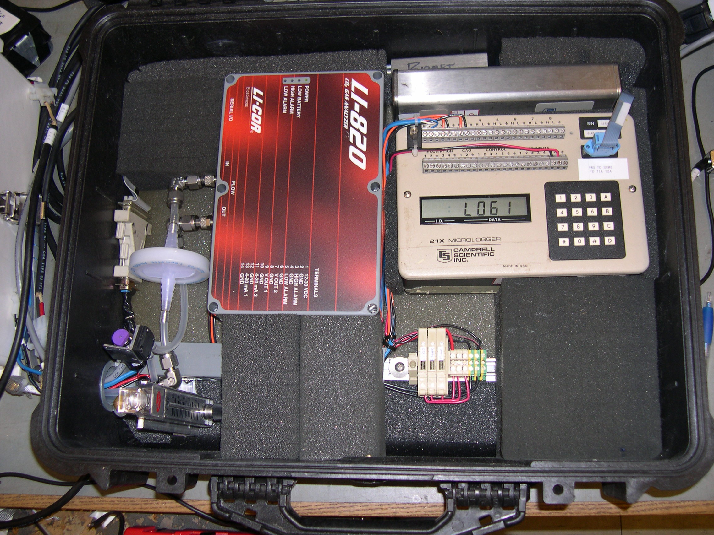
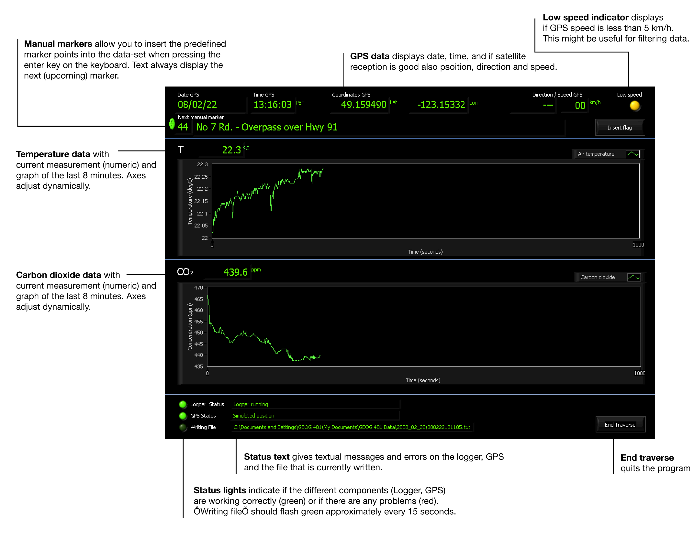

# Urban Climate Car Traverse System 

## Description

A labview-based software to run UBC's truck-mounted system. This system is used to measure temperature and carbon dioxide as the truck traverses along with GPS information. All data are written into a single text file. This system is used in <a href="http://ibis.geog.ubc.ca/courses/geob401/">UBC's GEOB 401 "Urban Meteorology"</a> course.

The hardware of the system contains five different components:

### Sensor Head

For the traverse exercise we operate a thermometer (copper-constantan thermocouple) and a carbon-dioxide sensor (Licor LI 820, measures carbon dioxide). The thermocouple and the inlet to the gas analyzer are located on the roof (driver-side) in a PVC tube to protect them. The tube is further surrounded by styrofoam insulation and covered by highly- reflective tape. To maintain a constant flow of air through the tube, the tube is ventilated by an DC blower-fan.

### Power Box 

This box is located on the back seat. It distributes power from the car battery to all other components (i.e. laptop, GPS and logger box). A number of fuses protect the different circuits of the system. 

### GPS 

This is a common hand-held GPS (Garmin GPS 76) that is programmed to stream location, speed and direction directly to the laptop. It comes with an external antenna which is located on the roof for best reception of satellite signals.

### Laptop

A PC with LabView that collects data from the logger and GPS and displays online graphs of both sensors along with the GPS data. The source files for this code are licated in the directory "Source"

### CO2 analyzer and logger box 

This box is in the canopy of the truck and contains the gas analyzer for CO2 and a programmable data logger (Campbell Scientific 21X) that measures the analog signals from the connected thermocouple and the analyzer and streams digital data to the laptop in the cabin. 

## Directory "Source"

The subdirectory "Source" contains all LabView VIs to build and run the application.

#### traverse.vi

This is the top-level user interface. It displays GPS data, measured air temperature and measured CO2 data traces. It allows users to insert marker points and displays the system status. 

#### welcome.vi

This is the welcome screen the uses sees when opening the application. The user can choose the COM-ports for GPS and data logger signals.

#### new_file.vi

This sub-vi is creating a datafile with name based on start time and date.

#### teaching_serial.vi and teaching_logger.vi

This sub-vi is used to read the serial data in form of a text-string from the COM-ports (GPS and Logger).

#### teaching_extract_serial.vi

This sub-vi is used to parse the logger data from the Campbell Scientific 21X logger into fields. 
<<<<<<< Updated upstream

#### writespreadsheetstring.vi

this is a generic vi that appends a spreadsheet line (string) to an existing file. 

#### GPSmap76.vi

This sub-vi parses one line of a string from the Garmin GPS 76 module into its components (Time, Longitude, Latitude, Altitude, Horizontal Position Error, Status, Speed, Direction). <a href="images/GPS_Signal.png">Here is a description of the raw GPS signal string</a> from the Garmin GPS 76 model.

#### writespreadsheetstring.vi

this is a generic vi that appends a spreadsheet line (string) to an existing file. 

#### GPSmap76.vi

This sub-vi parses one line of a string from the Garmin GPS 76 module into its components (Time, Longitude, Latitude, Altitude, Horizontal Position Error, Status, Speed, Direction). <a href="images/GPS_Signal.png">Here is a description of the raw GPS signal string</a> from the Garmin GPS 76 model.

#### uv_md.vi

This sub-vi translates northing and easting from the GPS into direction and speed. Used during parsing in GPSmap76.vi to display heading and speed on the top level "traverse.vi".

### Directory "Logger_Program"

This directory contains the logger program for the Campbell Scientific 21X data logger.

### Directory "Documentation"

This directory contains the operating instructions (for students) of the entire system in form of a word file.
